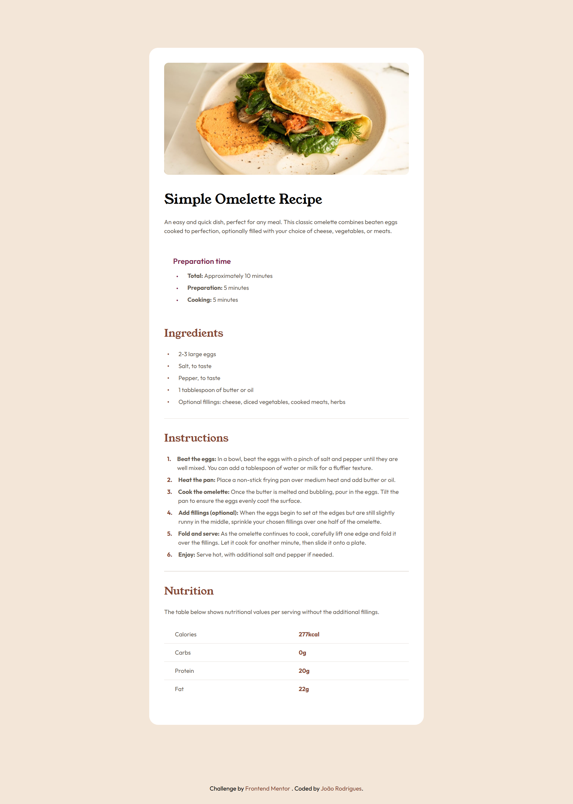

# Frontend Mentor - Recipe page solution

This is a solution to the [Recipe page challenge on Frontend Mentor](https://www.frontendmentor.io/challenges/recipe-page-KiTsR8QQKm). Frontend Mentor challenges help you improve your coding skills by building realistic projects.

## Table of contents

- [Overview](#overview)
  - [Screenshot](#screenshot)
  - [Links](#links)
- [My process](#my-process)
  - [Built with](#built-with)
  - [What I learned](#what-i-learned)
  - [AI Collaboration](#ai-collaboration)
- [Author](#author)

## Overview

### Screenshot

### Links

- Solution URL: [Solution URL here](https://www.frontendmentor.io/solutions/recipe-page-using-sass-css-d1kS2RHq3p)
- Live Site URL: [Live site URL](https://joao0330.github.io/recipe-page-frontendmentor)

## My process

### Built with

- Semantic HTML5 markup
- SASS CSS
- CSS custom properties
- Flexbox
- Mobile-first workflow

### What I learned

This project helped me solidify my HTML and CSS skills when working on a vanilla environment with a slightly more complex UI that differs significantly across multiple screen sizes.

### AI Collaboration

For this project I used chatGPT to help me build the Nutrition table since I hate working with tables in HTML :/

## Author

- Website - [João Rodrigues](https://joaogrodrigues.dev)
- Frontend Mentor - [@Joao0330](https://www.frontendmentor.io/profile/Joao0330)
